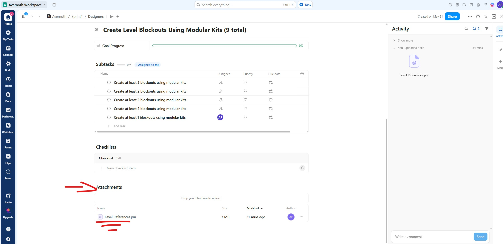

I just wanted to get everyone up to speed on how we’ll be assigning tasks going forward.

We’ll be using ClickUp for task delegation, and this will be managed by the leadership team—primarily by me (Andre). So if you have any questions about a task, please come to me.

Here’s how I’ve organized tasks in ClickUp:

- **Parent Tasks** are structured by **Goal** A team milestone essentially.
- **Subtasks** represent the **assigned/individual Tasks** required to achieve that **Goal**

We’re also using **tags** to indicate which discipline or skill set is needed for each task.

### Why this setup?

- I researched best practices for using ClickUp with large teams
- Everyone can clearly see the overarching goal they’re contributing to
- It’s easy to see who’s assigned to what and who you’re collaborating with
- To avoid excessive complexity, no task will be nested more than three levels deep

Below is example of how one would navigate the click up

1.**Open ClickUp and locate the Parent Task**

2.**Read the Parent Task description**

3.**Check the "Subtask" section for assigned tasks**

4.**Scroll to check for any Attachments**

5.**Click the link icon to view any added links**

**Important**

Team members are not responsible for closing their task, that will be done by leadership they only need to review the information given to them. 

In order for any task to be closed, it has to be reviewed by one of the Producers, Dimitri, Chelle, or anyone else with a lead role

It's essential that all team members review these sections when beginning a task. This helps prevent mistakes and clears up any confusion before work starts.

Each teammate is responsible for reviewing:

- The **Parent Task/Goal**
- The **Description**
- Any **Attachments**
- All included **Links**

This is especially important since we often use platforms like **PureRef**, **Miro**, and **GitHub** for documentation and references. Occasionally, I’ll also link the **ASG for Avernoth** in the description and specify the page number or section you should review before starting.

**Please make it a habit to check all of these sections before starting any task.** This will ensure clarity and help keep everyone aligned.

React with a "thumbs down" emoji if you read the whole thang. 