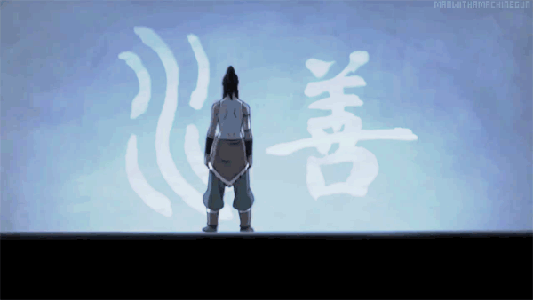
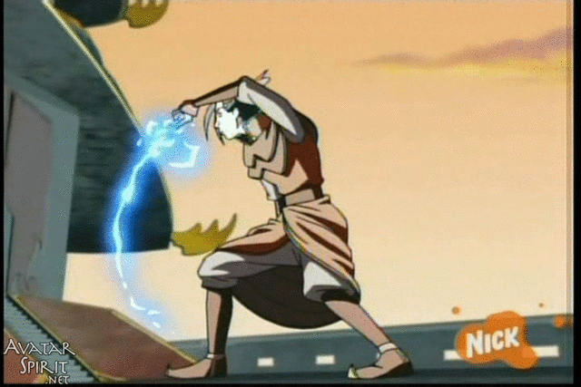
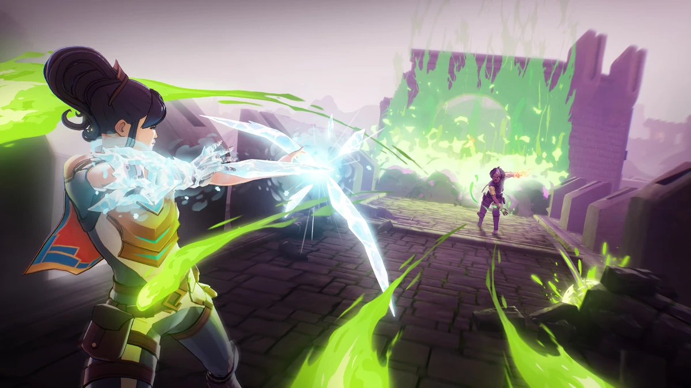

## Combat Design and Animation Approach in Avernoth

Avernoth features exclusively ranged combat. The player controls a powerful mage, and the design of their movement and attacks is rooted in three core considerations:

- **Personality**
- **Reputation as a mage**
- **Style of casting magic**

### What We Don't Want: Incantations

In the world of Avernoth, magic is fundamental. My initial concept for spellcasting was based on **incantations**—a performative style of magic focused on channeling and manifesting magical power through elaborate movements.
This direction calls for substantial animation work, as incantation spells require visually expressive motion. They also take alot of time to ready and fire, it's important to balance cast time  with the game’s pacing. No single movement should consume too much "animation time" nor slow down gameplay.

### Closer to What We Want: Avatar and Martial Arts

I then came to me the idea of **martial arts**. Martial arts emphasize quick, purposeful movements and controlled force. _Avatar: The Last Airbender_ inspired this approach, as they blend powers and martial arts. 
In the show, fighters channel elemental powers through established martial art techniques, making each action feel deliberate and impactful. 

Drawing from this, I wanted to capture the sense of channeling and releasing magical force, but in a way that is both manageable to animate and appropriate for Avernoth’s lore.  Animating full karate or tai chi routines isn’t practical or thematically fitting, but the concept: flair, swift, expressive, and focused movements—can be incorporated into spellcasting.

### What we ACTUALLY do Want: SpellBreak

_Spellbreak_, a magic-focused battle royale game, provides a useful reference. Characters are constantly channeling magic, then exerting force in a deliberate direction. This serves as a strong contemporary for how we can approach Allister's animations

**Tomes** in Avernoth serve as extensions of the mage’s magical ability—comparable to how ordinary people use tools. Swinging an axe, throwing a spear, or hammering a nail are conceptually similar to how Allister wields their tome.

Allister uses the power of the tome and directs that power to where he want's it to go.

## Allister Movement

Allister is an agile mage simular to the mages in SpellBreak. He's a mage who moves with a soft, controlled touch, using magic to enhance athletic ability.

One of the animators for _Spellbreak_ shared a significant portion of their workflow and reference material, which provides a strong foundation for designing Allister’s movement animations.

### Dashing
Dashing would most visibly showcase this relationship between Allister's magic and mobility. 

Reference video: Dashing

### Jumping

Jumping animations should continue the theme of agility, emphasizing a light and responsive leap.

Reference video: Jumping

### Running

When running, Allister maintains a simple jog, with the chest held slightly more upright to signal alertness and readiness.

Reference video: Running
https://youtu.be/YpLkEJ0sJu4?feature=shared&t=96

### Sprinting

Sprinting should demonstrate Allister’s combat awareness. Reference the character below, who carries their weapon by the hip to convey a battle-ready posture. In Allister’s case, the arm used to direct magic should trail behind, creating a unique, asymmetrical silhouette that emphasizes his readiness and personality.

**Pro tip**
(Use "," and "." / "*comma*" and "*period*"  to navigate frame by frame for Youtube videos)

Reference Video: Sprinting 
https://youtu.be/kQhq02clmWc?feature=shared&t=5694

## Animation Guidelines

- **Primary Focus:** Animate primarily through large joints—knees, shoulders, and elbows. Due to the stylized art direction, hand and finger movements should be minimal, with emphasis placed on expressive, readable joint movement.
    
- **Timing:** Animate on 2s at 30 frames per second to ensure deliberate, clear posing. Adjust timing only when a movement needs extra fluidity (animate on 1s) or when a slower, more posed feel is required (3s or more).
    
- **Readability:** Maintain clarity in silhouette and gesture to communicate motion and character intent at a glance.

## References

Check out B Gray their work is good 
https://vimeo.com/bgrayvy